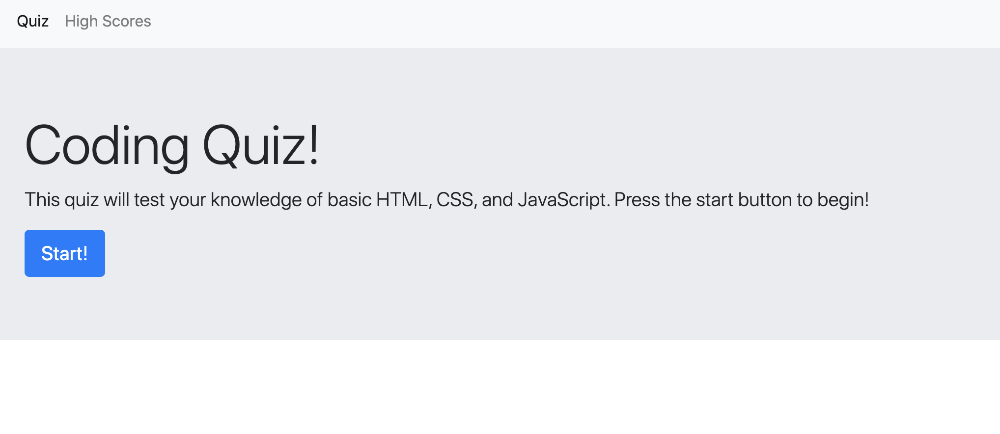
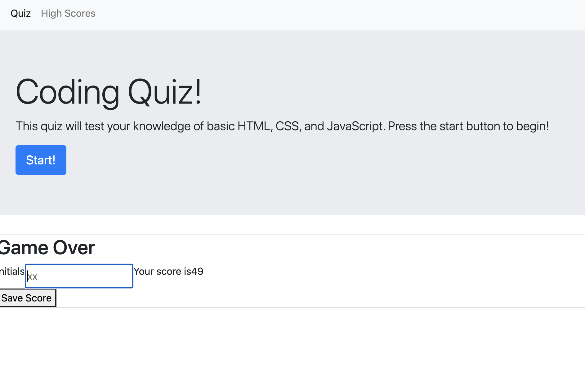

##  codeQuiz
This code quiz is designed to test you on basic knowledge of HMTL, CSS, and Javascript.
You will be asked a series of multiple choice quesitons, and will have 60 seconds to complete the quiz.  
If you select the wrong answer, 10 seconds will be deducted from your time.
When there are no more questions to answer, the time left is your score.  You will have the option to enter your initials and save your score to the leaderboard.

You can find the quiz here: https://richardwalter515.github.io/codeQuiz/

Have fun!!

Start of the Quiz:

Entering Initials:
